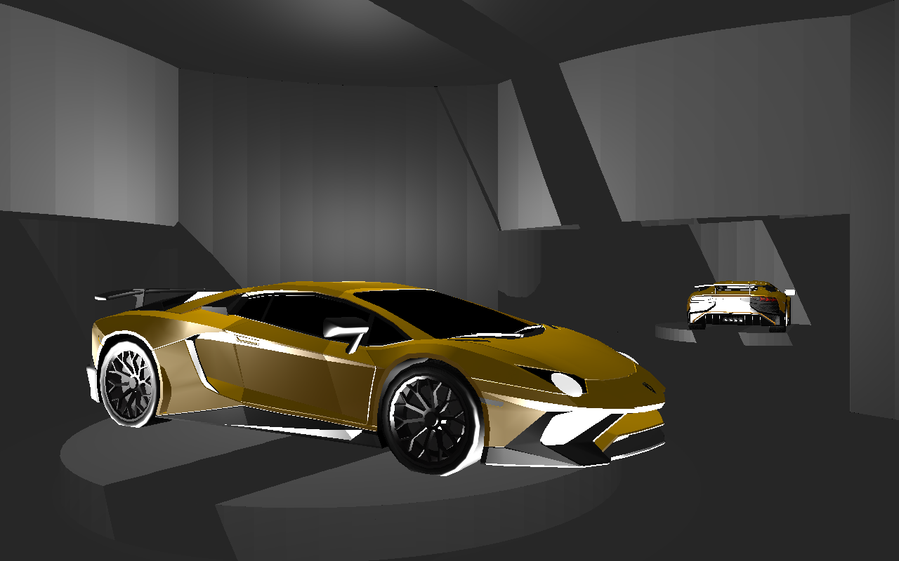
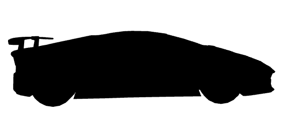
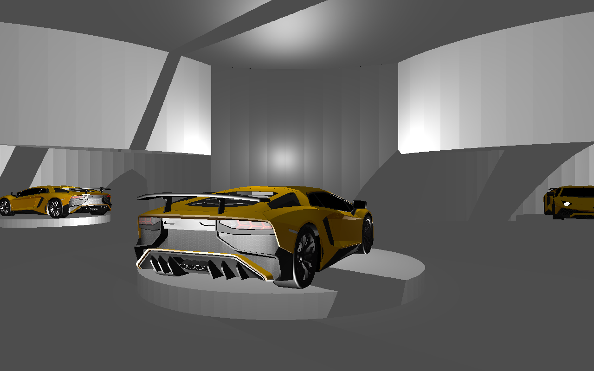
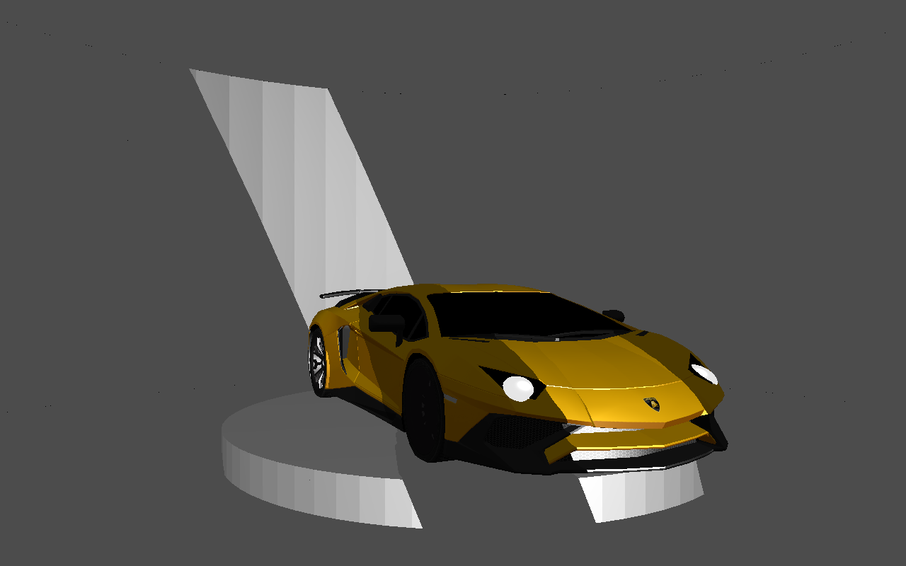
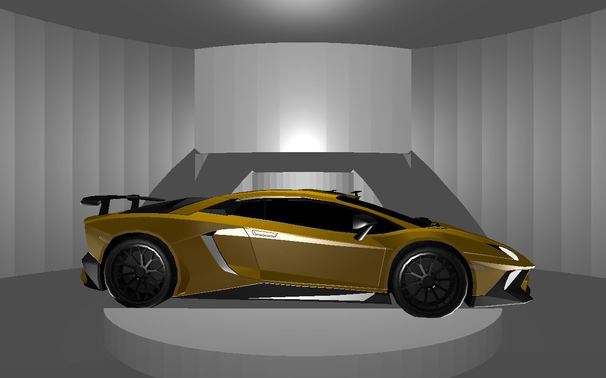
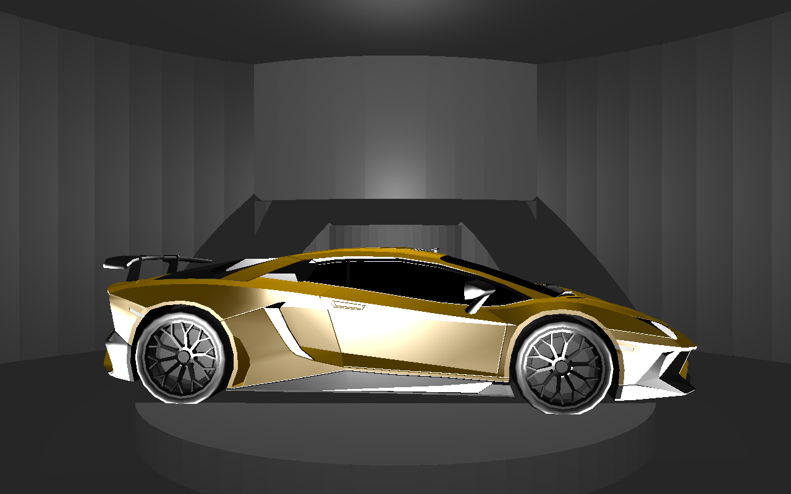
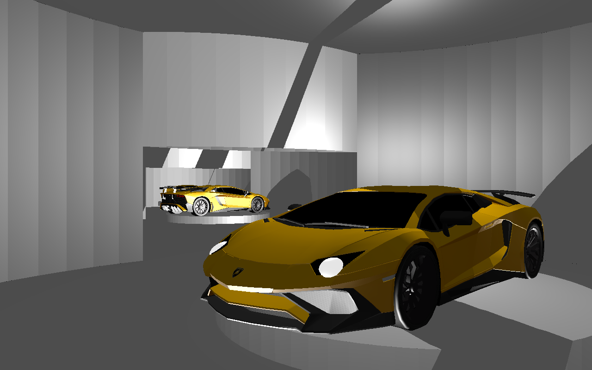

Supercar Showroom
=================

#### Quinn Coleman - CSC 471 - Spring 2018 - Christian Eckhardt

### Overview

\

For my quarter project in CSC 471, Introduction to Computer Graphics, I
was inspired by a racing-simulator video game called "Gran Turismo,"
mainly for its interactive and beautiful renderings of cars. In the car
dealership in Gran Turismo, players are allowed to select any sports car
for viewing mode inside a showroom. I wanted to create a sports car
showroom experience like this that a player can manually move around
within for themselves, while adding more features.

To begin, the player can move around the space with the WASD keys, and
cannot walk into the cars nor the walls with a collision detection
system. This collision detection system is based upon the camera's
radius in relation to the room's radius as well as the supercar's
radius. The sports car revolves on top of a spinning cylindrical
platform, and exhibits headlights that are brightly-lit objects
themselves. Now let's get into the distinguishing features of my
project.

Distinguishing features:

-   3D Sports Car Model
-   Randomly-Generated Rooms
-   Shadow-Mapping
-   Day/Night - Light Mode

### The 3d Model

I downloaded a free low-poly OBJ model of a Lamborghini Aventador LP
570-4 Superveloce, from a 3D model internet source linked below. I used
the material file it came with in the Shape class to generate the
textures for the car.

#### OBJ Shell Issue

I had to manually delete a section of the OBJ file, as it correlated to
a sub-object that encapsulated the car like a shell, which hid most of
the model's details when included.

 *Lamborghini Aventador LP 750-4 Superveloce OBJ Model*

 *Lamborghini Aventador LP 750-4 Superveloce Texture*

### Randomly-Generated Rooms

#### Data Structure

I created a 5x4 2D array to contain all information needed for the
possible rooms in which locations that could exist. I pound-defined
constants to convey all possible door-arrangements for any value inside
this array. I kept the random-generation simple for realism and only
made one layer of random-generation from the starting room.

#### Geometry

In order to properly create doorways between rooms, I filled the room
vertex array object (VAO) with enough vertices for 3 possible rooms:
3-door, 2-door and 1-door arrangments. I later used offsets to draw the
correct room from the VAO, and matrix transformations to arrange the
room appropriately to its location.

 *The showroom end product*

### Shadow-Mapping

#### Step 1) Render to Framebuffer

I duplicated my render function, for a total of two render calls per
frame. The first render call was made to render the entire scene from
the perspective of the light source, into a depth-map texture by using a
framer buffer. This texture contained dark red pixels for closer
objects, and light red pixels for further ones.

#### Step 2) Render to Screen

I then used the depth-map texture to render the scene to the screen,
while taking the depth into account to see which objects are obscured by
others, and thus colored as if in shadows.

#### Issues

While I achieved a dynamic shadowing, the shadows are not displayed as
would be expected. More work needs to be done to make sure that all
objects of interest in my scene are getting the light exposure needed
for correct shadow-mapping.

 *The showroom end product*

### Day/Night - Light Mode

I pass a uniform variable, that is changed upon each "L" key press, into
my shaders to adjust the lighting appropriately. Thus, in effect all
object get a standard and uniform amount of ambient, diffuse and
specular light in day-light mode. In night-light mode, I decrease the
lighting of the surrounding rooms, take away the specular lighting from
the rooms and increase specular light for the cars for dramatic effect.

 *Day-Light Mode*

 *Night-Light Mode*

### End Product

I was happy to see my project achieve its technical goals, and I would
like to keep refining it. For the future, I would like to fix the
positioning of shadows to be more realistic and subtle, add more car
models to the showroom, add emitting light from the headlights, add more
lighting modes, fix a collision response bug, add a user interface, and
add a sky-box that can be seen through new windows within the walls.

 *The end product*

### Download Project

-   [supercar\_showroom.zip](supercar_showroom.zip)

### Resources

-   [Gran Turismo Offical Site](https://www.gran-turismo.com/us/)
-   [Lamborghini Aventador 3D
    Model](https://www.turbosquid.com/3d-models/3d-lamborghini-aventador-model/1117798)

